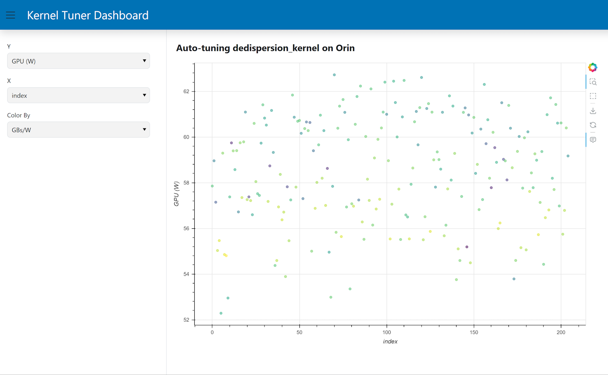

# PowerSensor3 Demo

This repository contains the code made for demonstration of the use of PowerSensor3 with Kernel Tuner.



# Installation

To use this, you should first obtain a PowerSensor3 device and accompanying software:
https://github.com/nlesc-recruit/PowerSensor3

Make sure to install the Python bindings that come with the PowerSensor3 software.

Then install Kernel Tuner and the Kernel Tuner dashboard using:

```bash
pip install kernel_tuner[cuda]
pip install git+https://github.com/KernelTuner/dashboard
```

# Running the demo

As part of this demo we are going to auto-tune a time-domain dedispersion kernel for performance (measured in GB/s) and energy efficiency 
measured in GBs/W, which is the same as GB/J. The average power as measured using PowerSensor3 during the execution of the dedispersion 
kernel is reported as "GPU (W)", basically GPU power in Watts. Whether PowerSensor3 reports the power of your whole device or only the GPU 
depends on your setup.

To start auto-tuning run the following command:
```bash
python dedispersion.py
```

Then, while that is running move to another terminal and type:
```bash
ktdashboard dedisp_cache.json
```

This should print the URL where the dashboard is running. Typically, port forwarding is used to allow the browser to run on your local system, while the dashboard runs somewhere else, for example on the headnode of a cluster.
This may require that you change a setting in your browser to allow 'localhost' to be proxied as well. 

The file ``dedisp_cache.json`` is persistent, if you give the demo a second time Kernel Tuner will resume where it had left off last time. If 
you want to start the demo again from scratch delete the dedisp_cache.json file.

If all goes well, it should look like the image at the top of this readme.


